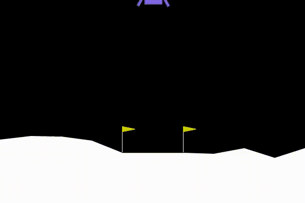
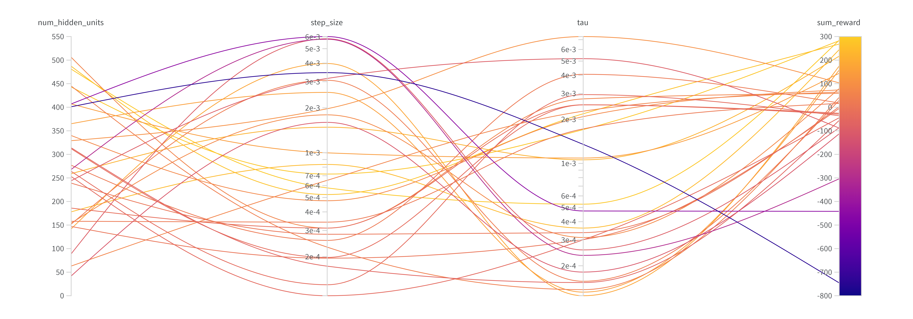

# Reinforcement Learning - Lunar Lander

The purpose of this project is to implement an agent making use of the expected SARSA algorithm to solve the lunar lander environment from OpenAI's gym. A neural network learns how to map the 6 available continuous state features (position x, position y, velocity x, velocity y, angle, angular velocity) into action-values, corresponding to the 4 available actions (do nothing, fire left engine, fire right engine, fire main engine). To make a more efficient use of experience, a replay buffer is used: for every timestep several updates are performed (with expected SARSA) using past transitions stored in memory. In pseudocode:

$$
\begin{align*}
& Q_t \leftarrow \text{action-value network at timestep t (current action-value network)}\\
& \text{Initialize } Q_{t+1}^1 \leftarrow Q_t\\
& \text{For } i \text{ in } [1, ..., N] \text{ (i.e. N} \text{  replay steps)}:\\
& \hspace{1cm} s, a, r, t, s'
\leftarrow \text{Sample batch of experiences from experience replay buffer} \\
& \hspace{1cm} \text{Do expected SARSA update with } Q_t: Q_{t+1}^{i+1}(s, a) \leftarrow Q_{t+1}^{i}(s, a) + \alpha \cdot \left[r + \gamma \left(\sum_{b} \pi(b | s') Q_t(s', b)\right) - Q_{t+1}^{i}(s, a)\right]\\
& \hspace{1.5cm} \text{ making sure to add the } \gamma \left(\sum_{b} \pi(b | s') Q_t(s', b)\right) \text{ for non-terminal transitions only.} \\
& \text{After N replay steps, we set } Q_{t+1}^{N} \text{ as } Q_{t+1} \text{ and have a new } Q_{t+1} \text{ for time step } t + 1 \text{ that we will fix in the next set of updates. }
\end{align*}
$$

This allows for great performance with just a few hundred episodes:

  

  

Lastly, a random sweep is performed over a wide range of values for the step size, the softmax temperature and the number of units in the hidden layer to find the optimal values of these hyperparameters:

  

